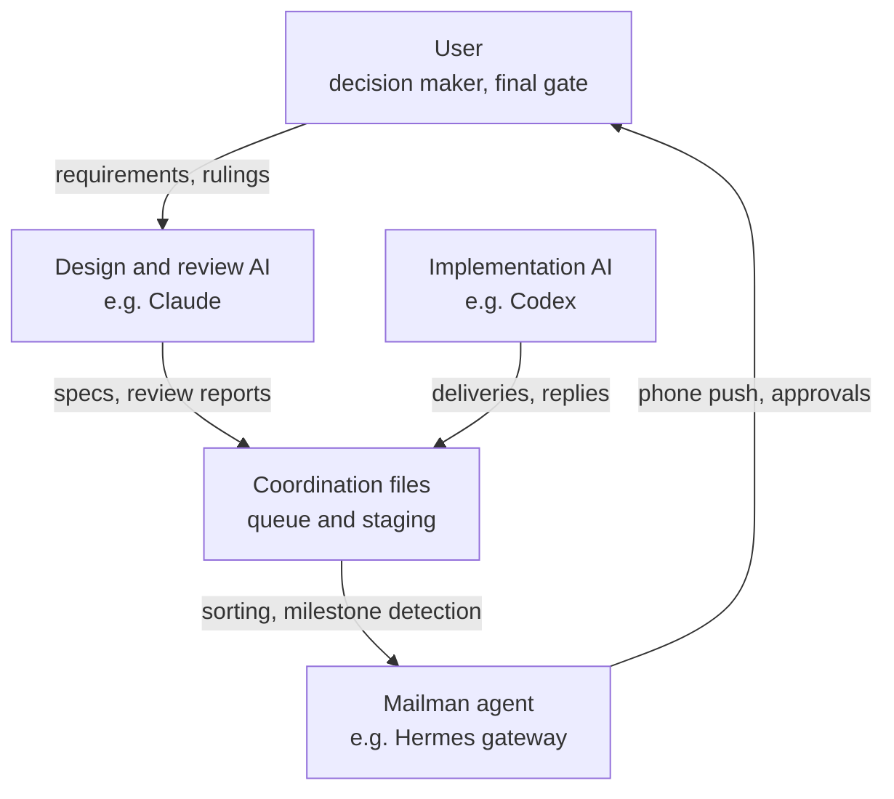
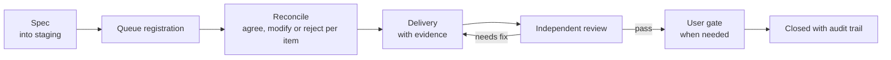
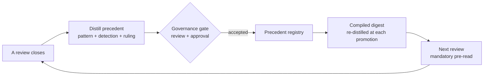
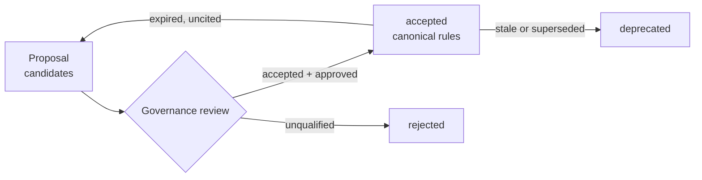
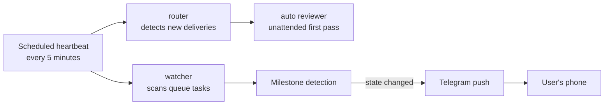
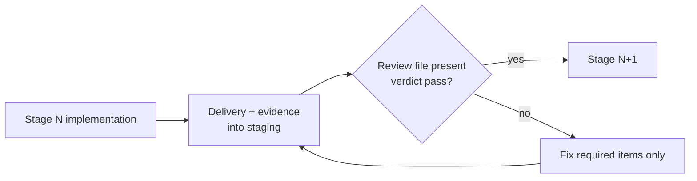

# Multi-Agent AI Collaboration Framework

**Version** 1.2 | **Date** 2026-06-13 | **Nature**: a replicable institutional design, distilled from a four-agent system in real production
**New in v1.2**: the role boundary upgraded to a code-enforced lane guard (with a risk-gated emergency override), lane boundaries defined at design time, the bidirectional autonomy loop closed (bounded worker + recursion guard + activation-by-drill), lessons expanded to nine

---

## 1. What problem does this solve

However capable a single AI assistant is, it has four structural defects:

1. **Nobody reviews it** — an AI accepting its own work lets errors accumulate silently.
2. **Context is finite** — long projects span dozens of conversations, each starting from amnesia.
3. **No governed memory** — either nothing is remembered, or everything is (including the wrong things).
4. **The human becomes the mailman** — relaying messages between AI tools by copy-paste.

This framework addresses all four with five pillars: **role separation + file-based coordination + review gates + governed memory + scheduled automation**. The whole system runs on an ordinary Windows PC — no server, no database. At its core it is **one folder and a few disciplines**.

---

## 2. Three axioms

Everything else is a corollary of these:

> **Axiom 1: Players don't referee.**
> The AI that designs and reviews writes no production code; the AI that implements never accepts its own delivery. Nobody can objectively review code they wrote — role separation is the precondition for any quality loop.

> **Axiom 2: Files are the single source of truth.**
> All coordination flows through plain-text files (append-only), never through anyone's conversational memory. "Where are we?" is always answered from files, never from recollection.

> **Axiom 3: A gate exists only where code enforces it.**
> If "requires approval before execution" lives only in a document while a scheduler runs the armed code — the approval has already been bypassed. Every declared gate must point to the mechanism (flag, file check, permission) that enforces it.

---

## 3. Role architecture



| Role | Duties | Explicitly forbidden |
|------|--------|----------------------|
| User | Requirements, decisions, high-risk gate approvals | Should never need to relay messages |
| Design/review side | Specs, root-cause diagnosis, independent review | Never edits production code |
| Implementation side | Builds to spec, delivers with evidence, replies item-by-item | Never self-reviews or self-passes |
| Mailman agent | Notifications, intake sorting, phone approval surface | Never writes to the canonical knowledge base |

Roles bind to **duties, not brands** — any two or more AI tools that can read and write files qualify.

---

## 4. The coordination layer: files as the message bus

```
coordination/
├── queue.md          ← task ledger (append-only, single source of truth)
├── broadcast.md      ← broadcasts (append-only)
├── README.md         ← entry format contract + claim contract
├── staging/
│   ├── <TASK-ID>/    ← one folder per task
│   │   ├── spec or proposal
│   │   ├── reconcile (implementer's item-by-item reply)
│   │   ├── delivery report and evidence
│   │   ├── review reports
│   │   └── coordination_claim.json (claim stamp)
│   └── ...
└── outbox/           ← durable return notices (for automated executors)
```

**Core conventions:**

- **Task IDs**: `YYYYMMDD-short-name`, referenced consistently throughout.
- **Append-only**: queue entries are never edited; state changes append new sections; **readers resolve each task by its LATEST section** (lesson 4).
- **Format contract**: entry fields are specified in writing, and **every automated parser must tolerate the loose formats humans actually write** — we once went blind for days because the parser only recognized the legacy dialect while every new entry used a newer one, and the health reports kept saying "all clear".
- **Claim/lease**: before processing any task folder, an agent writes a claim stamp (who, when, lease expiry); other agents back off an active claim; expired leases may be reclaimed. With multiple agents in parallel, "two actors grabbing the same letter" becomes mechanically impossible rather than a matter of etiquette.

### Task lifecycle



Reconcile is the load-bearing step: the implementer replies **agree / modify / reject for every spec item**, negotiating disagreements in place. Architectural changes require both sides' agreement before any code — preventing "the spec dreams one thing, the implementation builds another".

---

## 5. The review system

**First principle of review: trust no report — re-run everything.**

The reviewer's standard moves on receiving a delivery:

1. Read the diff and delivery report;
2. **Independently re-run** all verification (compile, tests, audit scripts) — never accept pasted results;
3. Run the checks the implementer forgot to list;
4. Write probes to reproduce anything suspicious;
5. Score against the fixed rubric + list required / non-blocking items;
6. Review report into staging, conclusion into the queue.

**Fixed rubric (against judge drift)**: four dimensions at 25 points each — spec fidelity, evidence quality, safety & gate discipline, operational durability; 80 is the pass line. Every finding carries **two labels**: severity (HIGH/MEDIUM/LOW/INFO) and **certainty** (PROVEN = verified by the reviewer's own re-execution or direct inspection / INFERRED = concluded from reading / SPECULATIVE = plausible concern without direct evidence). Iron rules: **SPECULATIVE never blocks alone**; hard checks (tests, compile, audit scripts) always outrank model judgment.

**Iteration is bounded**: the needs_fix loop runs at most THREE rounds; a third failure stops the loop and escalates — to the user, or back to design. Never an unbounded ping-pong. Fix rounds address ONLY the listed required items; opportunistic refactoring is forbidden.

**Two review layers**: an unattended scheduled first-pass (read-only) plus an interactive deep review when a human is present. **The authority order is fixed**: hard checks > interactive tool-enabled review > automated context-limited review — a lower tier never overrides a higher one. An automated reviewer that cannot see the evidence it needs must return "evidence gap — escalate", never needs_fix or pass (lesson 5).

---

## 6. The Review Court: reviews that learn from reviews

The review system ensures *this* review is right; the Review Court ensures the *next* one is better. Its core is **case law**:



- **A precedent** is a significant ruling distilled into a standalone entry — failure pattern, how to detect it, the ruling, applicability bounds. One-off bugs don't earn precedents; **patterns likely to recur across tasks** do.
- **Mandatory pre-read**: every reviewer (automated included) loads the accepted precedents as a checklist before reviewing.
- **Precedents are governed too**: candidate → review → acceptance, the same lifecycle as all shared memory; stale precedents are deprecated, not silently forgotten.
- Academic anchor: this institutionalizes Reflexion (memory as the cross-session outer improvement loop) — **the system's review capability rises monotonically with every review, and survives every session reset.**

Our precedent registry validated itself on opening day: hours after we recorded precedent five — "a fix written for a lesson is itself an untested path" — it caught a bug that only exploded on a refresh branch that had never once been executed.

---

## 7. The gate system

Not everything should be automated. Risk tiers:

| Tier | Examples | Handling |
|------|----------|----------|
| Low | Docs, tests, internal scripts | Auto-execute, review after |
| Medium | Behavior changes, scheduled tasks, notification channels | Execute after review passes |
| High | Money, credentials, public release, data deletion | **User gate: explicit human approval first** |

**Approvals must leave structured traces.** After the verbal "go ahead", record a machine-queryable field:

```
user_approved_<item>: <ISO timestamp> | <approver> | <scope>
verbatim: "OK, proceed with option A"
```

Three months later, anyone — human or AI — can answer "who approved what, when, and within what scope".

**Axiom 3 in practice**: we once had documentation declaring "awaiting approval" while the scheduler was already running the armed code — the system fired the first shot itself. The lesson is now institutional: **declaring a gate requires pointing at the code or config line that enforces it**, and reviews verify each such claim. The coordination contract now reads: *"a staging note, queue field, or handoff sentence is a request for a gate, not the gate itself."*

### 7.1 The lane guard: turn the role boundary into code, not a reminder

Axiom 1 (players don't referee), if it lives only in a document, eventually meets an agent that misjudges and edits product code that wasn't its to write — the failure mode is never "the rule wasn't written", it's "it didn't recognize whose lane this was". So make it a **pre-write gate**: when the design/review agent attempts to edit the implementer's product code (or the coordination infrastructure), the action is blocked *before it happens* with "this is the other lane — write a spec and hand off". A document can be ignored; a pre-write deny cannot.

But it **must not be a dead block** — a genuine incident has to be handled immediately, without waiting for the other agent to wake. So the emergency override is gated **by a risk threshold enforced in code**, not an absolute lock:

- Default: blocked.
- Allowed only when: **risk is HIGH, or risk is MEDIUM but the issue directly freezes the system / is a security risk**; with a fresh timestamp (e.g. within 60 minutes); and every override is auto-logged to an audit trail.
- Low risk, routine work, stale or non-qualifying overrides: still blocked.

That is "the gate is code, the exception must be deliberate AND clear a risk bar, and every override leaves a record" — not a dead block, but "route to the other lane by default, bypass in one second in an emergency, and every bypass is risk-checked".

### 7.2 The lane boundary is part of design, not an afterthought

Whenever you assess or design a new project, decide up front whether it will produce "other-lane" product code. If it will: **define the risk first** (which path is product code; product code vs. coordination / spec / probe; why direct edits are risky), **then register that path into the guard list** — before implementation starts, not bolted on later. A new product repo is never left unguarded by default.

---

## 8. Governed memory (the Memory Palace)

Cross-agent long-term memory is not a log pile — it is **a shared asset requiring governance**.

```
memory/
├── shared/
│   ├── candidates/   ← proposals (any agent may write)
│   ├── accepted/     ← canonical rules (promotion gate only)
│   ├── rejected/     ← failed proposals (kept on record)
│   ├── deprecated/   ← retired rules
│   └── _maintenance/ ← scripts and weekly health reports
└── private/<agent>/  ← per-agent private areas (mutually unreadable)
```



**Hard rules (violations are rejected outright):**

- No secrets (tokens, passwords, .env);
- No raw chat logs or session transcripts — **memory stores curated rules, not running commentary**;
- No business-domain knowledge (that belongs in the knowledge base, not agent memory);
- Every entry carries audit fields (who, when, why) + an append-only change history;
- Promotion to accepted requires the gate; no agent ever self-approves its own proposal.

**Automatic aging**: candidates pending past 30 days raise alerts; accepted entries carry expiry dates and return for re-review when expired and uncited. A weekly scheduled maintenance run produces health reports (pending age, expiry countdowns, duplicate IDs, secret scans).

---

## 9. The automation pipeline: making the mailman redundant



One OS scheduled task runs a pure-script pipeline every five minutes:

- **watcher** parses the queue and sorts tasks into "to implement / to reply / to approve" with priorities;
- **router** detects new deliveries in staging and generates review requests (folders without a primary artifact are marked wait-for-artifact, never churned);
- **auto reviewer** invokes a read-only AI for the first pass (claim before, release after);
- **milestone detection** pushes one-line events — "reply landed / verdict out / awaiting approval" — to the user's phone, **naming the task and whose move is next**.

Iron rules: **notification failure never fails the pipeline** (best-effort); **automation only sorts and notifies — lifecycle changes (promotion, closure) always pass through gates**; **the five-minute heartbeat itself costs zero LLM tokens** (pure local scripts; the model appears only when a real review request exists).

### 9.1 Closing the loop: bounded autonomous dispatch

The pipeline above automates *notification*; the last mile is automating *action* — the system wakes the right agent the moment it detects work, in both directions (implementer picks up specs, reviewer picks up deliveries), with no human relaying anything. Key design points:

- **Event-driven, not scheduled shifts**: the zero-cost detector already knows when work exists — so it launches one worker at the moment of detection. Zero cost when idle, action within minutes when there's work; more immediate than any fixed cadence, and no idle burn.
- **The worker is strictly bounded** (the linchpin of safe autonomous writes): writes only to its own task folder, shell limited to verification commands (compile / run tests), no network, hidden launch, single-flight, daily cap — all enforced by code gates, not prompt instructions.
- **Recursion guard (non-negotiable)**: an autonomous agent must **never** auto-act on changes to its *own* dispatch / review machinery — those tasks escalate to a human-supervised tier. A system that can auto-approve changes to its own approval machinery has no gate.
- **Activation is itself the highest gate**: this capability turns on only after live drills prove it stays bounded — drills must simultaneously show (a) the happy-path dispatch works, (b) every escape attempt is denied, (c) self-referential tasks correctly refuse to auto-run — plus explicit human approval.

Only here does "the human as mailman" truly end: the human appears only when asked to decide and approve; relaying, status-checking, chasing, and forwarding all disappear.

---

## 10. Token economy: the three-tier ladder

A personal budget is not a corporate unlimited plan — but **savings must never cost quality**. Three tiers; only the top one is the goal:

| Tier | Meaning | Stance |
|------|---------|--------|
| Starvation | Feeding less, or broken, input to save money | **Forbidden.** Empirically: reviews fed truncated evidence issued three wrong verdicts in a row, and the repair cost more than one properly-fed review — starvation loses twice |
| Compression | Same judgment, fewer tokens | **A legitimate saving, with a hard line**: judgments made from condensed material (e.g. the precedent digest) must match judgments made from the full text — fail that equivalence check and the condensed version may not be used |
| Refinement | Same tokens, more judgment | **The direction.** The digest is re-distilled at every update — synthesizing across cases, sharpening detection cues, retiring redundancy. Judgment-per-token rises with accumulation |

The floor is "quality never drops"; there is no ceiling — the system only rewards going up.

Operational principles:

- **Deterministic first**: compile/tests/audit scripts cost zero tokens and outrank the model in reliability — a red light closes the case without a drop of model ink;
- **Never re-do identical work**: unchanged artifact hashes re-emit the previous verdict;
- **Fold calls**: new extraction needs ride existing LLM calls as structured output — no new always-on calls;
- **Every new recurring LLM step must declare a weekly token estimate** — silent recurring spend is a high-severity finding (budgets, like gates, must live where the code runs);
- **Quality wins conflicts**: when economy and quality collide in a specific case, quality wins and the cost is recorded for redesign — never silently absorbed by degrading the review.

---

## 11. Long-horizon goal mode: stage gates

For multi-day objectives, use the implementer's long-horizon mode (e.g. Codex `/goal`) — but **autonomy is not exemption from review**:



- The goal definition is a file (objective, verifiable completion condition, constraints, per-stage scope); the goal command points at it;
- **Stage gates are file states**: the next stage opens only when a review file with a pass verdict exists in staging — mechanism, not honor system; when interactive and automated reviews conflict, interactive wins;
- Blocked over 24 hours: update the queue and pause — never skip a gate;
- The final completion condition is **an audit script** emitting proven / gated / missing per requirement; only all-proven completes the goal.

Field note: these gates passed their trial by fire unattended, overnight. The implementing AI received a *generic* review-pass document, judged on its own that it did not satisfy the stage-specific gate, and refused to advance; its attempt to summon a review directly was blocked by its own safety policy — **it did not bypass**, but filed a formal delegation, wrote full diagnostics, and stayed paused until morning. Gates prove their worth precisely when nobody is watching.

---

## 12. Nine lessons, all paid for

| # | Lesson | Incident |
|---|--------|----------|
| 1 | Parse liberally, write conservatively | The queue evolved two dialects; automation recognized only the old one and went task-blind for days — while health reports said "all clear" |
| 2 | "Never happened" must be verified, not presumed | The notification feature had been live for days; archaeology showed it had never actually sent one production message — even its test was a dry-run |
| 3 | Gates in code; documents don't count | Docs said "awaiting approval" while the scheduler ran the armed code and fired the first shot itself |
| 4 | Append-only needs latest-state-wins reads | Tasks accumulated status sections; the scanner read only the first and resurrected long-closed tasks as zombies |
| 5 | An evidence gap is not a defect | Automated reviews kept failing deliveries they could not see; the correct ruling is "escalate to a tier with access", never a content verdict on invisibility |
| 6 | In parallel lanes, check the envelope first | With concurrent tasks, agents grabbing the wrong folder is a real risk; the cure is task-ID discipline plus the claim mechanism |
| 7 | When the reviewed party edits the review tooling, flag it | The implementer patched the reviewer itself to unblock a gate — the direction was tightening, so no harm, but "self-referential change" must be a mandatory delivery label, not a lucky catch |
| 8 | A fix written for a lesson is itself an untested path | The patch that cured scanner blindness shipped with a same-day-refresh branch that crashed the first time it ever ran — every new path needs a test that has walked it |
| 9 | Trust no report — including your own check | During verification, a buggy check command (it reported "problem" whether or not it matched) nearly raised a false alarm about an escape that did not exist; re-verification showed the check itself was wrong. Hard checks must themselves be checked |

---

## 13. Minimal viable adoption

You don't build it all at once. Four steps:

**Step 1 (ten minutes): the file coordination layer.**
One `queue.md`, one `staging/` folder, one page of format contract. From then on, all handovers go through files; the human only says "go check your mail".

**Step 2 (half a day): review discipline.**
Role separation, item-by-item reconcile, independent re-runs, the fixed rubric with its 80-point line, the three-round needs_fix cap. The quality loop now exists — without a single line of automation.

**Step 3 (incremental): automate piece by piece.**
Scheduled heartbeat → watcher sorting → push notifications → automated first-pass review → claims → long-horizon goal mode. After each piece, audit it against the eight lessons.

**Step 4 (continuous): open the Review Court.**
Distill precedents from significant reviews, gate them into memory, pre-read them before every review. From this step on the system is not merely running — **it is getting stronger**. Forging is never one strike: every new discussion should put old conclusions back in the fire, fold and quench again — that is how you get Damascus steel.

**There is exactly one yardstick for progress: is the human's remaining work nothing but decisions and approvals?** Everything else — relaying, status-checking, chasing, forwarding — should be steadily disappearing.

---

## Appendix: glossary

| Term | Meaning |
|------|---------|
| reconcile | The implementer's item-by-item reply to a spec (agree / modify / reject) |
| staging | The dedicated artifact folder per task |
| user gate | A checkpoint requiring explicit human approval |
| needs_fix | Review failure with a required-items list (three rounds max) |
| claim/lease | Claim before processing; expired leases reclaimable; prevents double work |
| milestone event | A state change worth notifying a human about |
| Memory Palace | Governed shared memory (candidates-to-accepted lifecycle) |
| precedent | A reusable pattern distilled from a review ruling (detection + ruling + bounds) |
| certainty label | A finding's evidence grade: PROVEN / INFERRED / SPECULATIVE |
| re-distillation | Digest re-refined at every promotion; judgment density rises with accumulation |
| proven / gated / missing | An audit script's three-state verdict per completion requirement |
| lane guard | A pre-write interception that blocks an agent from editing code outside its lane; carries a risk-gated emergency override |
| risk-gated override | The emergency-bypass bar: HIGH risk, or MEDIUM + system-freeze/security; low-risk or stale stays blocked |
| recursion guard | An autonomous agent may not auto-act on changes to its own dispatch/review machinery; always escalates to the human tier |

---

*This specification is distilled from a real production system: two AI coding agents, one messaging-gateway agent, and one user, on a single Windows PC, governing the full path from requirement to delivery through plain text files. Every lesson in this document is a post-mortem of an actual incident.*
