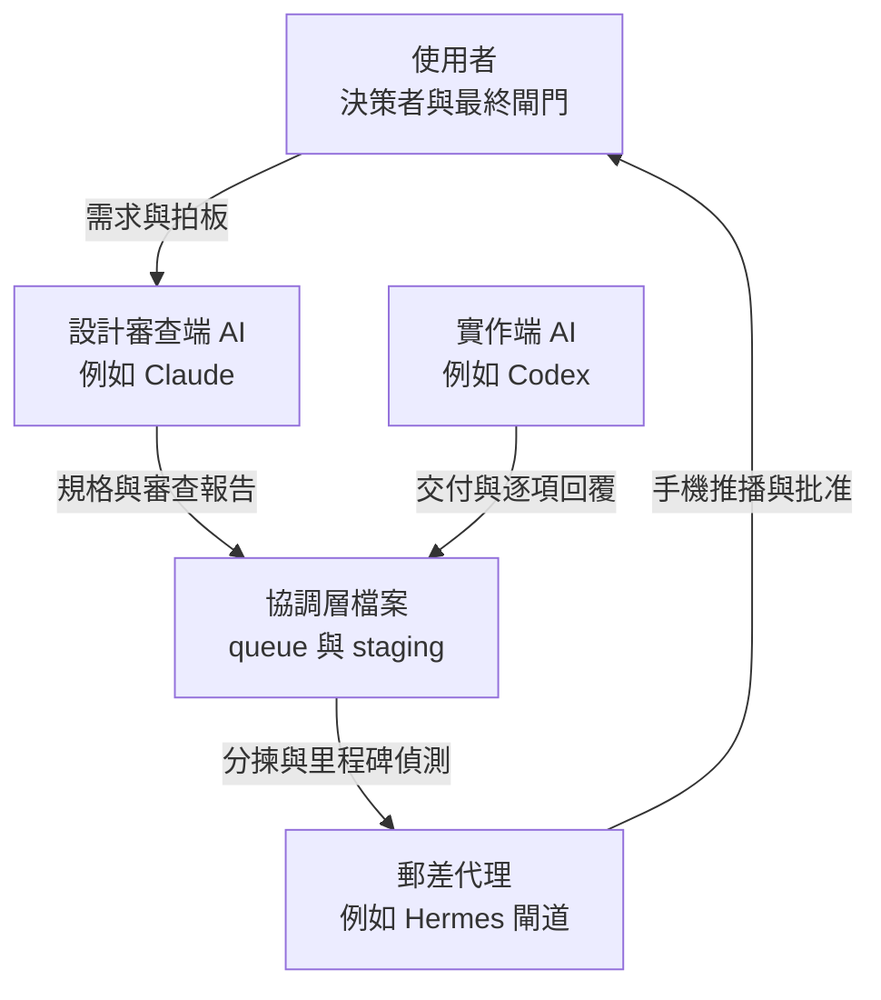
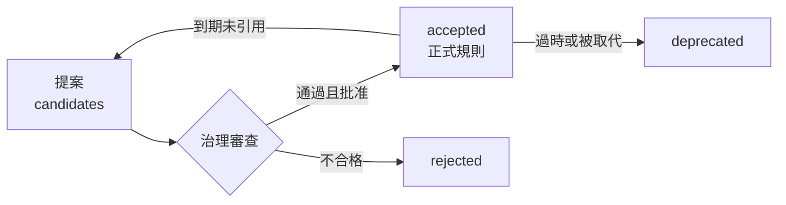
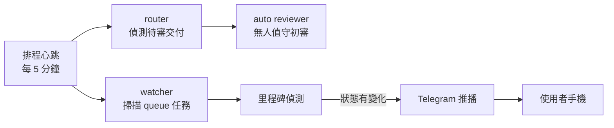
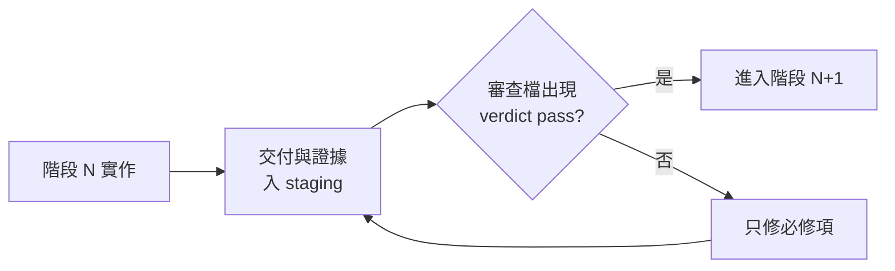

# 多代理 AI 協作制度規格書

**版本** 1.0 ｜ **日期** 2026-06-11 ｜ **性質** 可複製的制度設計,源自真實運轉中的四代理系統

---

## 1. 這套制度解決什麼問題

單一 AI 助手再強,都有四個結構性缺陷:

1. **沒人審查它**——AI 自己寫的東西自己驗收,錯誤會安靜地累積。
2. **上下文有限**——長專案跨越數十次對話,每次都從失憶開始。
3. **沒有治理的記憶**——要嘛什麼都不記,要嘛什麼都記(包括錯的)。
4. **人類變成郵差**——多個 AI 工具之間的訊息傳遞全靠人肉複製貼上。

本制度用「**角色分離 + 檔案協調 + 審查閘門 + 治理記憶 + 排程自動化**」五個支柱解決以上問題。整套制度在一台普通的 Windows 個人電腦上運轉,不需要伺服器,不需要資料庫,核心只是**一個資料夾和幾條紀律**。

---

## 2. 三條公理

整套制度建立在三條公理上,其他一切都是推論:

> **公理一:球員不兼裁判。**
> 設計與審查的 AI 不寫生產程式碼;實作的 AI 不驗收自己的交付。審查者自己寫的程式碼,沒有人能客觀審查——角色分離是品質迴圈成立的前提。

> **公理二:檔案是唯一真相。**
> 所有協調走純文字檔案(append-only),不依賴任何一方的對話記憶。「現在進度如何」的答案永遠來自檔案,不來自誰的印象。

> **公理三:閘門必須寫進代碼,只寫在文件不算。**
> 「需要批准才能執行」如果只是文件裡的一句話,而排程器跑著上膛的代碼——那批准就已經被繞過了。每一道閘門都要有對應的機制(旗標、檔案檢查、權限)強制執行。

---

## 3. 角色架構



| 角色 | 職責 | 明確禁止 |
|------|------|----------|
| 使用者 | 提需求、決策、批准高風險閘門 | 不需要當訊息中繼站 |
| 設計審查端 | 寫規格、根因診斷、獨立審查交付 | 不下場改生產程式碼 |
| 實作端 | 依規格實作、附證據交付、逐項回覆 | 不自審、不自行標記通過 |
| 郵差代理 | 通知推播、進件分揀、手機批准介面 | 不直接寫入正式知識庫 |

角色綁的是「職責」不是「品牌」——任何兩個以上能讀寫檔案的 AI 工具都能套用。

---

## 4. 協調層:檔案就是訊息匯流排

```
coordination/
├── queue.md          ← 任務登記簿(append-only,唯一真相)
├── broadcast.md      ← 廣播訊息(append-only)
├── README.md         ← queue 條目格式契約
├── staging/
│   ├── <任務ID>/     ← 每個任務一個資料夾
│   │   ├── spec 或提案
│   │   ├── reconcile(實作端逐項回覆)
│   │   ├── 交付報告與證據
│   │   └── 審查報告
│   └── ...
└── outbox/           ← 持久化回執(供自動執行器認領)
```

**核心慣例:**

- **任務 ID**:`YYYYMMDD-簡短名稱`,全程引用同一 ID。
- **append-only**:queue 不改舊條目,狀態變化追加新 section;最新 section 的狀態為準。
- **格式契約**:條目欄位(status / assignee / reviewer / risk)的寫法明文規定,**所有自動化解析器必須相容人手寫的寬鬆格式**——我們曾因解析器只認舊格式,導致整個自動化對新任務「全盲」三天而無人察覺。

### 任務生命週期


reconcile 是關鍵一步:實作端對規格**逐項回覆 agree / modify / reject**,有異議就地協商。架構級變更必須雙方同意才動工——避免「規格一廂情願、實作另起爐灶」。

---

## 5. 審查制度

**審查的第一原則:不信報告,重跑驗證。**

審查端收到交付後的標準動作:

1. 讀 diff 與交付報告;
2. **獨立重跑**所有驗證(編譯、測試、驗證腳本)——不採信對方貼的結果;
3. 補跑對方漏列的驗證項;
4. 對可疑行為**寫探針實測重現**;
5. 評分(滿分 100,80 為放行線)+ 列出 required / non-blocking 項;
6. 審查報告入 staging,結論入 queue。

**雙層審查:**

- **自動初審**:排程器偵測到交付即喚起無人值守的 AI 審查(限唯讀、限證據範圍);
- **互動深審**:人在場時由互動 session 做工具級驗證。**衝突時互動審查優先**——自動審查受限於它看得到的證據,曾因「證據檔被截斷」連續給出錯誤的不通過判定。

**needs_fix 迴圈**:不通過時只列必修項,實作端只修列出的項目,改完再審。禁止「順手重構」擴散變更面。

---

## 6. 閘門制度

並非所有事都讓 AI 自動做。風險分級:

| 風險級 | 例子 | 處理 |
|--------|------|------|
| 低 | 文件、測試、內部腳本 | 實作端自動執行,事後審查 |
| 中 | 行為變更、排程任務、通知管道 | 審查通過後執行 |
| 高 | 花錢、憑證、對外發布、刪除資料 | **user gate:使用者明文批准才動** |

**批准必須結構化留痕。**口頭「好啊」之後,記錄成機器可查的欄位:

```
user_approved_<事項>: <ISO時間戳> | <批准人> | <範圍>
原話: 「好,就照方案 A 執行」
```

這讓三個月後的任何人(或任何 AI)都能回答「這件事誰、何時、批准了什麼範圍」。

**公理三的實戰版**:我們曾發生「文件寫了要等批准、但排程器已在跑新代碼」——系統自己把第一槍開了。教訓固化為制度:**宣告閘門的同時,必須指出強制它的機制在哪一行代碼或哪個設定**,審查時逐一核對。

---

## 7. 記憶治理(記憶宮殿)

跨代理的長期記憶不是日誌堆,是**需要治理的共享資產**。

```
memory/
├── shared/
│   ├── candidates/   ← 提案區(任何代理可寫)
│   ├── accepted/     ← 正式規則(僅閘門可晉升)
│   ├── rejected/     ← 不合格提案(留檔可查)
│   ├── deprecated/   ← 過時規則
│   └── _maintenance/ ← 維護腳本與週報
└── private/<代理>/   ← 各代理私有區(互不可讀)
```



**硬規則(違反即拒收):**

- 不收秘密(token、密碼、.env);
- 不收原始聊天記錄與 session 日誌——**記憶收的是「策展後的規則」,不是流水帳**;
- 不收業務領域知識(那屬於知識庫,不屬於代理記憶);
- 每筆記憶必帶審計欄位(誰、何時、為何變更)+ append-only 變更歷史;
- 晉升 accepted 需通過審查閘門,任何代理不得自提自批。

**自動老化**:candidates 超過 30 天未審→提醒;accepted 設到期日,到期未被引用→退回重審。每週排程維護產出健康報告(pending 老化、到期倒數、重複 ID、秘密掃描)。

---

## 8. 自動化管線:讓郵差失業



一個作業系統排程任務,每 5 分鐘跑一輪純腳本管線:

- **watcher** 解析 queue,分揀出「待實作 / 待回覆 / 待批准」的任務並標優先級;
- **router** 偵測 staging 裡出現的新交付,自動產生審查請求;
- **auto reviewer** 喚起唯讀 AI 完成初審;
- **里程碑偵測** 對「回覆落地 / 審查出爐 / 等待批准」等事件,推播一行訊息到使用者手機,**寫明任務名與下一棒是誰**;
- **認領機制(claim/lease)**:任何執行器處理任務前先蓋認領章,防止兩個代理拿同一封信。

設計鐵則:**通知失敗不影響管線**(best-effort);**自動化只分揀與通知,生命週期變更(晉升、結案)永遠過閘門**。

---

## 9. 長程目標模式:階段閘門

對於跨多日的大目標,使用實作端的長程模式(如 Codex `/goal`)讓它持續推進,但**自治不等於免審**:



- 目標定義寫成檔案(目標、可驗證的完成條件、約束、各階段範圍),goal 指令指向該檔;
- **階段閘門是檔案狀態**:staging 出現審查檔且 verdict 為 pass,才准進下一階段——機制化,不靠自覺;
- 卡關超過 24 小時:更新 queue 狀態並暫停,不准跳關;
- 最終完成條件是**一支稽核腳本**,逐項輸出 proven / gated / missing,全 proven 才算達標。

---

## 10. 實戰教訓六則

每一條都是真實付過學費的:

| # | 教訓 | 事故摘要 |
|---|------|----------|
| 1 | 解析器要寬容,寫入要規範 | queue 格式自然演化出兩種方言,自動化只認舊方言,對新任務全盲多日——而健康報告天天顯示「一切正常」 |
| 2 | 「從未發生」要驗證,不能推定 | 通知功能上線數日,翻遍歷史發現它在生產環境一次都沒真正發送過,連測試都是 dry-run |
| 3 | 閘門寫進代碼,文件不算 | 文件宣告「待批准」,排程器卻已在跑上膛的新代碼,自己開了第一槍 |
| 4 | append-only 需要「最新狀態為準」的讀法 | 任務多次追加狀態,掃描器只看第一段,把早已結案的任務當成待辦殭屍 |
| 5 | 無人值守審查需要看得到證據 | 自動審查因證據檔截斷連續誤判不通過;規則改為「互動審查優先,證據必須函式完整」 |
| 6 | 多線並行先認信封 | 多個任務同時進行時,代理拿錯任務資料夾的風險真實存在;解法是任務 ID 紀律 + 認領機制 |

---

## 11. 最小可行導入(給想自己搭一套的人)

不需要一次蓋完。三步起步:

**第一步(十分鐘):建檔案協調層。**
一個 `queue.md`、一個 `staging/` 資料夾、一頁格式契約。從此兩個 AI 之間的交接全部過檔案,人只負責「叫對方去看信」。

**第二步(半天):立審查紀律。**
角色分離(誰設計審查、誰實作)、reconcile 逐項回覆、審查獨立重跑、80 分放行線、needs_fix 只修必修項。此時品質迴圈已經成立,自動化還一行都不用寫。

**第三步(漸進):逐件自動化。**
排程心跳 → watcher 分揀 → 推播通知 → 自動初審 → 認領機制 → 長程 goal 模式。每加一件,就用第十節的教訓對照檢查一次。

**成長的判斷標準只有一個:人類在流程裡做的事,是不是只剩「決策與批准」。** 其他一切——傳話、查狀態、催進度、轉交付——都應該逐步消失。

---

## 附錄:術語對照

| 術語 | 含義 |
|------|------|
| reconcile | 實作端對規格的逐項回覆(agree / modify / reject) |
| staging | 每個任務專屬的工件資料夾 |
| user gate | 必須由使用者明文批准的檢查點 |
| needs_fix | 審查不通過,附必修清單 |
| claim/lease | 處理前先認領,防止重複處理 |
| 里程碑事件 | 值得通知人類的狀態變化 |
| 記憶宮殿 | 治理式共享記憶(candidates 到 accepted 生命週期) |
| proven / gated / missing | 稽核腳本對完成條件的三態判定 |

---

*本規格書源自一套真實運轉的系統:兩個 AI 編碼代理、一個訊息閘道代理與一位使用者,在一台 Windows 個人電腦上,用純文字檔案完成了從需求到交付的完整治理。文中所有教訓均為實際事故的覆盤。*
